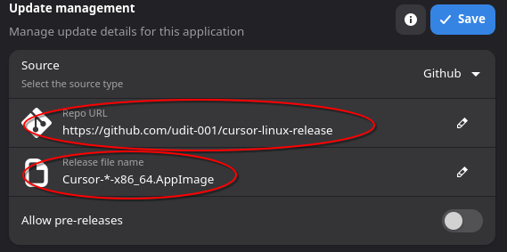

<h1 align="center">
  
  <span>Cursor AppImage Updater</span>
</h1>


<p align="center">
  <a href="https://github.com/udit-001/cursor-linux-release/releases/latest" target="_blank"></a>
  <span> </span>
  <a href="https://github.com/udit-001/cursor-linux-release/actions/workflows/release.yml" target="_blank"></a>
  <span> </span>
</p>

## Overview

GitHub Action to fetch the latest **Cursor** Linux AppImage and create a release.

## Why?

Cursor on Linux:
- ❌ Doesn’t auto-update
- ❌ Isn’t hosted at a fixed URL
- ✅ Has an API with the latest version info

This makes it hard for Linux users to keep Cursor up to date & this action solves that by:
- Querying Cursor’s API for the latest version
- Checking if that version already exists as a GitHub release
- If not, downloading the AppImage and publishing a release

Linux users can then update via GitHub releases, scripts, or package managers using a consistent URL.

## Setup Auto Updates with Gear Lever

To automate updates for your Cursor AppImage on Linux, use [Gear Lever](https://github.com/mijorus/gearlever). It supports update sources like GitHub releases and static URLs.

### Adding the Update Source

1. Open Gear Lever and navigate to **Update management**
2. Select **Github** as the source type
3. Enter the repository URL: `https://github.com/udit-001/cursor-linux-release`
4. Set the release file name based on your system architecture:
   - **x86_64**: `Cursor-*-x86_64.AppImage`
   - **ARM64**: `Cursor-*-aarch64.AppImage`
5. Configure other settings as needed (e.g., toggle "Allow pre-releases" if desired)
6. Click **Save** to apply the configuration



### Alternative: Direct Update URLs

You can also configure Gear Lever using direct update URLs:

- **x86_64**
  ```
  https://github.com/udit-001/cursor-linux-release/releases/download/*/Cursor-*-x86_64.AppImage
  ```

- **ARM64**
  ```
  https://github.com/udit-001/cursor-linux-release/releases/download/*/Cursor-*-aarch64.AppImage
  ```

These URLs will allow automatic fetching of the latest releases. For more detailed instructions, refer to the [update guide](https://mijorus.it/posts/gearlever/update-url-info/).


## 📅 Release Status
- **⏳ Last Released On**: 2026-01-25 22:30:59 UTC
- **🔄 Last Run**: 2026-01-25 22:30:59 UTC
